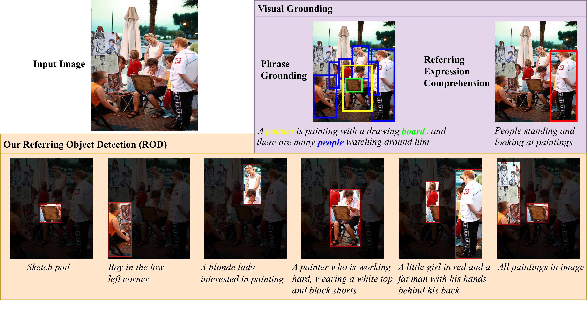
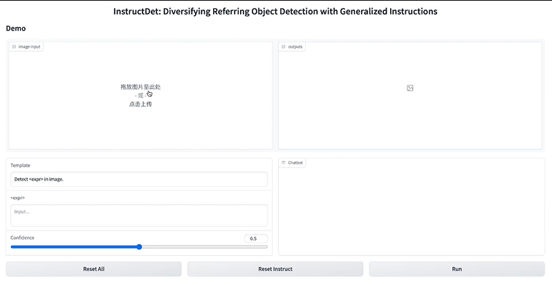
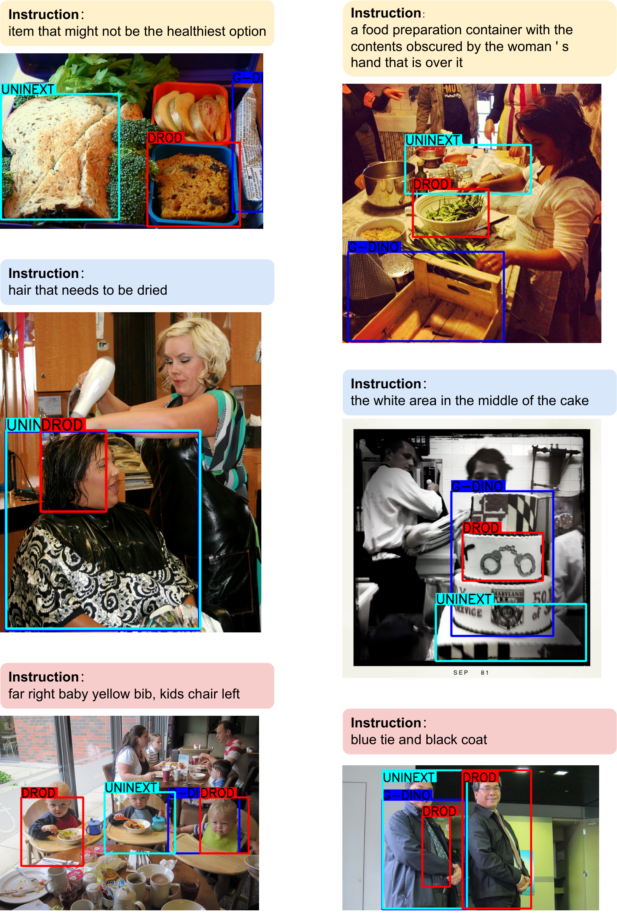
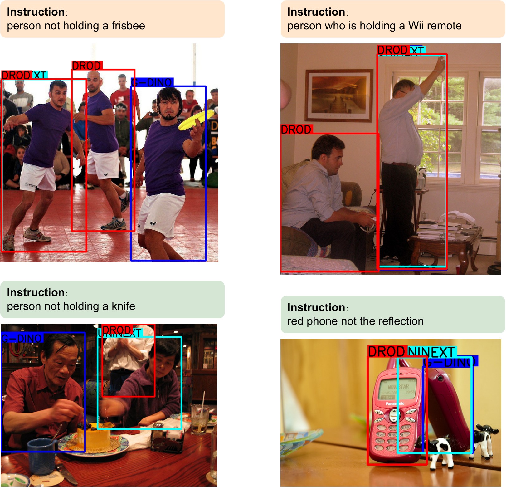

<p align="center">
  <h4 align="center"><font color="#966661">InstructDet</font>: Diversifying Referring Object Detection with Generalized Instructions</h4>
  <p align="center"></p>
</p>

***
<font color="#966661">**InstructDET**</font>, a data-centric method for **referring object detection**(ROD) that localizes target objects based on user instructions.

Our ROD aims to execute diversified user detection instructions compared to visual grounding. For images with object bbxs, we use foundation models to produce human-like object detection instructions. By training a conventional ROD model with incorporating tremendous instructions, we largely push ROD towards practical usage from a data-centric perspective.

## Release
- [2024/01/30] The InDET dataset and instruction generation code are released.
- [2024/01/16] Our InstructDET [paper](https://arxiv.org/pdf/2310.05136.pdf) has been accepted by ICLR 2024.

## Demo Video
[](https://www.youtube.com/watch?v=huRehKBSCDQ "Demo of InstructDet")

## Examples
Our diversified referring object detection(DROD) model, visual comparison with [UNINEXT](https://github.com/MasterBin-IIAU/UNINEXT) and [Grounding-DINO](https://github.com/IDEA-Research/GroundingDINO).



## Download InDET
The annotations of our InDET dataset are in refcoco format and you can download from [Google Drive](https://drive.google.com/drive/folders/1owjyEd1H3pu1_-gZrSiwzyQY1FIlKQey?usp=drive_link) or [Baidu Pan](https://pan.baidu.com/s/1oYBVt79E7V3cIl7abfVWvA?pwd=tzkm).
The images in our InDET dataset contains images from RefCOCO/g/+ (RefCOCO/g/+ images come from [MSCOCO](https://cocodataset.org/#download)), [Flicker30K entities](https://github.com/BryanPlummer/flickr30k_entities), and [Objects365 v2](https://www.objects365.org/overview.html) (we sample 6000 images). Please follow their instructions to download the images and put them under a base data directory in the following structure.
```
├─ indet_images
     ├─ coco
     │    └─ train2014
     ├─ flickr30k_entities
     └─ objects365v2
          ├─ train
          ├─ val
          └─ test
```

## Instruction Diversify Inference

Using code in this repository, one can reproduce instructions similar to those in our InDET dataset. Our method do not modify image or bboxes, we expand the text instructions only. The initial input should be images and bboxes of interested objects. **Inferencing with multiple gpus is not supported for now,** you can spliting the dataset into batches by specify *startidx* and *stride* for generation efficiency.

### Install
Environment requirements: python==3.8, CUDA==11.6, torch==1.13.1.
```Shell
# git clone our repository
git clone https://github.com/jyFengGoGo/InstructDet.git
cd InstructDet

# build and install module dependencies
cd modules/fastchat
pip install -e .
cd ../llava
pip install -e .
cd ../instruct_filter/CLIP
pip install -e .
pip install -r requirements.txt
```

### Foundation Model Weights

We use foundation models to generate human-like object detection instructions, links to download the model weights are listed here. 
**NOTE**: If your machine can access network, then only llava/vicuna/minigpt4 linear-layer weights need to be manually downloaded while the others will be automatically downloaded.
| process | model | download |
| ---  | --- | --- |
| global prompt | LLAVA & Vicuna | [llava-v1.5-13b](https://huggingface.co/liuhaotian/llava-v1.5-13b), [vicuna-13b-v1.3](https://huggingface.co/lmsys/vicuna-13b-v1.3) |
| local prompt | MiniGPT4 | [vicuna-13b-v0-merged](https://huggingface.co/j-min/vicuna-13b-v0-merged), [eva_clip_g](https://storage.googleapis.com/sfr-vision-language-research/LAVIS/models/BLIP2/eva_vit_g.pth), [T5](https://storage.googleapis.com/sfr-vision-language-research/LAVIS/models/BLIP2/blip2_pretrained_flant5xxl.pth), [linear layer](https://drive.google.com/drive/folders/1Rg7rut_QxnH05n2-4kGjWiDjHlkWDKV7?usp=drive_link), [BERT](https://huggingface.co/bert-base-uncased) |
| instruction filtering | CLIP | [ViT-B/32](https://openaipublic.azureedge.net/clip/models/40d365715913c9da98579312b702a82c18be219cc2a73407c4526f58eba950af/ViT-B-32.pt) |
| instruction grouping | Vicuna | - |

When the model weights are ready, replace corresponding model paths in the following configs.
```Shell
configs/instructdet.yaml
modules/minigpt4/minigpt4/configs/models/minigpt4_local.yaml # if your machine can access network, use minigpt4.yaml
modules/minigpt4/eval_configs/minigpt4_local_eval.yaml  # if your machine can access network, use minigpt4_eval.yaml
```

### Prepare Dataset
Download images and annotations of RefCOCO/g/+ (RefCOCO/g/+ images come from [MSCOCO](https://cocodataset.org/#download)), [Flicker30K entities](https://github.com/BryanPlummer/flickr30k_entities), and [Objects365 v2](https://www.objects365.org/overview.html) (we sample 6000 images).

### Run

1. Data Pre-Process
Format transferring: transfer refcoco/coco/flickr30k_entities format into jsonline format, please refer to [refcoco2llavainput.py](./tools/format_tools/refcoco2llavainput.py)/[o3652llavainput.py](./tools/format_tools/o3652llavainput.py)/[flickr30k2jsonlines.py](./tools/format_tools/flickr30k2jsonlines.py).
2. Instruction generation, please refer to [instructdet output format](https://ones.ainewera.com/wiki/#/team/JNwe8qUX/space/9y6Fb55f/page/AiSDgNAP) for output details.
```Shell
# bash scripts/run.sh {startidx} {stride}
bash scripts/run.sh 0 100
```
3. Post-Process
Format transferring: transfer jsonline format into refcoco format, please refer to [tools/format_tools/jsonline2refcoco.py](./tools/format_tools/jsonline2refcoco.py)

## Cite

```bibtex
@article{dang2023instructdet,
  title={InstructDET: Diversifying Referring Object Detection with Generalized Instructions.},
  author={Dang, Ronghao and Feng, Jiangyan and Zhang, Haodong and Ge, Chongjian and Song, Lin and Gong, Lijun and Liu, Chengju and Chen, Qijun and Zhu, Feng and Zhao, Rui and Song, Yibin},
  journal={arXiv preprint arXiv:2310.05136},
  year={2023}
}
```

## Acknowledgement & License
This project makes use of [LLaVA](https://github.com/haotian-liu/LLaVA), [MiniGPT-4](https://github.com/Vision-CAIR/MiniGPT-4), [FastChat](https://github.com/lm-sys/FastChat) and [CLIP](https://github.com/openai/CLIP). See the related subfolders for copyright and licensing details: [LLaVA](./modules/llava/LICENSE), [MiniGPT-4](./modules/minigpt4/LICENSE.md), [FastChat](./modules/fastchat/LICENSE), [CLIP](./modules/instruct_filter/CLIP/LICENSE). Thanks for their wonderful works.

For images from COCO, Flickr30k and Objects365, please see and follow their terms of use: [MSCOCO](https://cocodataset.org/#download)), [Flicker30K entities](https://github.com/BryanPlummer/flickr30k_entities), [Objects365 v2](https://www.objects365.org/overview.html).
